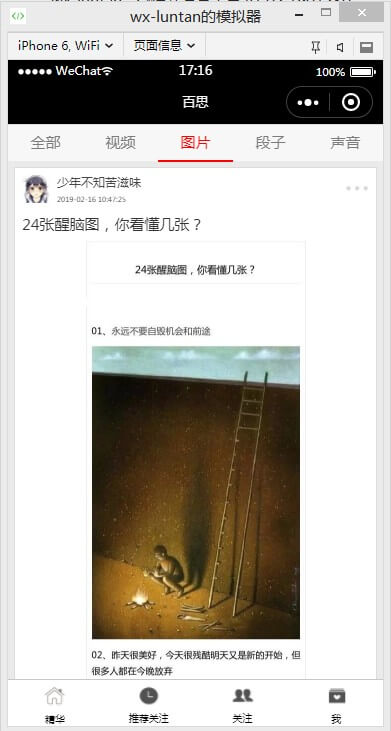
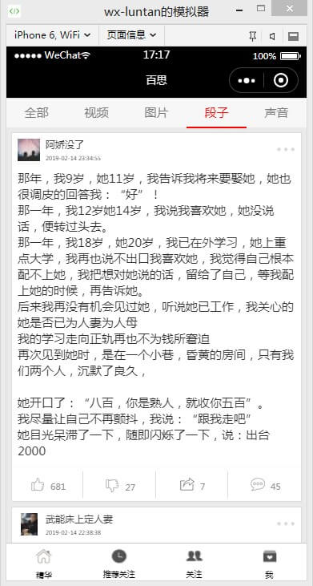
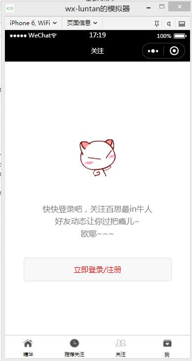
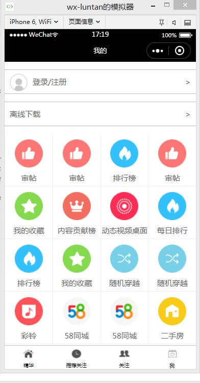
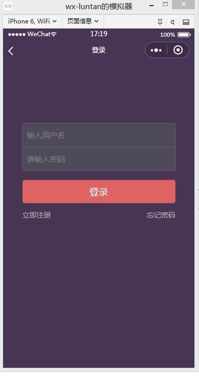

# 微信小程序 仿百思不得姐
## 设备
- 微信开发者工具 v1.02.1901230
## 扩展
- 修复了视频点击播放不流畅的问题
- 修复了视频的暂停够无法播放问题
- 优化了部分页面
## 接口

- 首页 [http://api.budejie.com/api/api_open.php?a=list&c=data&type=1](http://api.budejie.com/api/api_open.php?a=list&c=data&type=1)

	- type=1 	: 全部
	- type=41 : 视频
	- type=10 : 图片
	- type=29 : 段子
	- type=31 : 声音
	- 加载更多 : 添加两个字段 
		- page : 页码 (加载下一页需要)
		- maxtime : 获取到的最后一条数据的**maxtime**字段 (加载下一页需要)
- 评论列表 [http://api.budejie.com/api/api_open.php?a=dataList&c=comment&data_id=22062938&hot=1](http://api.budejie.com/api/api_open.php?a=dataList&c=comment&data_id=22062938&hot=1)

	- data_id : 帖子ID
	- hot : 获取到最热评论需要这个字段
	- page : 页码 (加载下一页需要)
	- lastcid : 获取到的最后一条评论的ID(加载下一页需要)

- 推荐关注
	- 左侧列表 [http://api.budejie.com/api/api_open.php?a=category&c=subscribe](http://api.budejie.com/api/api_open.php?a=category&c=subscribe)
	- 右侧列表 [http://api.budejie.com/api/api_open.php?a=list&c=subscribe&category_id=35](http://api.budejie.com/api/api_open.php?a=list&c=subscribe&category_id=35&page=1)
		- category_id : 左侧栏目 ID
		- page : 当前页码 ,请求第一页数据的时候可不填
	
- 我的 [http://api.budejie.com/api/api_open.php?a=square&c=topic](http://api.budejie.com/api/api_open.php?a=square&c=topic)

## 首页

## 推荐关注

## 关注

## 我的

## 登录
